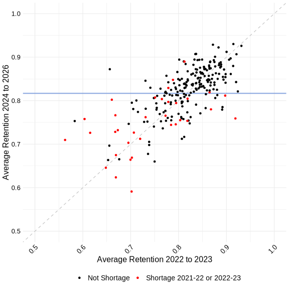

```js
const labor_market_outcomes = FileAttachment(
  "data/labor-market-outcomes.csv",
).csv();

const district_retention = FileAttachment("data/district-retention.csv").csv();
```

# Arkansas Teacher Retention 2025-26: A New Normal

In [last year's post](https://oep.uark.edu/2024-25-arkansas-teacher-retention-statewide-stability-amid-ongoing-local-challenges/), we highlighted early signs that Arkansas teacher retention recovery may have plateaued below pre-pandemic levels. New data for the 2025-26 school year confirms this. For the second straight year, approximately 12.7 percent of Arkansas teachers left the classroom, a rate that continues to sit will above the roughly 11 percent rate typical before the pandemic.

What's behind this plateau? Below, we explore the parts of the picture which are returning to normal - and one that is not.

## Retention Rates Remain Low in 2025-26

After an initial rebound from the 2022-23 low point, Arkansas's teacher retention rate has leveled off - still about 1.5 pp below pre-pandemic levels. In 2025-26, roughly 87.3 percent of teachers returned to the classroom. This rate is effectively unchanged from 2024-25, raising the question of whether this is the new normal for retention in the state.

```js
import { retentionRateChart } from "./components/retention-rate-chart.js";
display(retentionRateChart(labor_market_outcomes));
```

To understand what's behind these rates, we sort teachers based on their employment decisions between the 2024-25 to 2025-26 school years:

- <span style="color: blue; font-weight: bold;">Stayers</span> remained teaching in the same school(s);
- <span style="color: blue; font-weight: bold;">Mover</span> transferred to a different school or district;
- <span style="color: blue; font-weight: bold;">Switchers</span> moved to a non-teaching role within Arkansas public schools;
- <span style="color: blue; font-weight: bold;">Exiters</span> left the Arkansas public school system entirely.

In 2025-26:

- 77.1 percent of teachers were Stayers;
- 10.2 percent of teachers were Movers who remained teaching in a new school - 5.3 percent within the same district and 4.9 percent in a new district;
- 3.5 percent of teachers were Switchers;
- 9.1 percent of teachers were Exiters - 6.4 percent left the Arkansas public school workforce and 2.7 percent retired.

```js
import { retentionBarChart } from "./components/retention-bar-chart.js";
display(retentionBarChart(labor_market_outcomes));
```

The overall retention rate of 87.3 percent counts both Movers and Stayers, since teachers in both remained teaching in Arkansas public schools in 2025-26. But the stability in this overall rate hides a few important stories of what's happening on the ground.

## Exits, Not Retirements

Retirements are not driving the decline in retention rates. In 2025-26, approximately 2.7 percent of teachers retired. This mirrors last year's rate exactly, and sits slightly below pre-pandemic levels.

```js
import { changeFromBaselineChart } from "./components/change-from-baseline-chart.js";
import * as d3 from "npm:d3";

// Pre-pandemic school years used as the baseline for change calculations
const PRE_PANDEMIC_YEARS = new Set([
  "2014-15", "2015-16", "2016-17", "2017-18", "2018-19", "2019-20",
]);

// Transforms raw labor-market-outcomes data into { x, category, change } rows
// for a change-from-baseline chart. Pre-pandemic years are averaged into a
// single "Pre-pandemic avg." baseline point (change = 0 by definition).
// Post-pandemic years show the pp delta from that baseline.
function computeBaselineDeltas(data, categoryLabels) {
  const filtered = data.filter((d) => categoryLabels.includes(d.category));

  // Per-category baseline: mean of pre-pandemic values
  const baselines = {};
  for (const label of categoryLabels) {
    const preRows = filtered.filter(
      (d) => d.category === label && PRE_PANDEMIC_YEARS.has(d.schoolyear),
    );
    baselines[label] = d3.mean(preRows, (d) => +d.value);
  }

  // Map rows to { x, category, change }, collapsing pre-pandemic years to one point
  const transformed = [];
  const seenBaseline = new Set();
  for (const row of [...filtered].sort((a, b) =>
    a.schoolyear.localeCompare(b.schoolyear),
  )) {
    if (PRE_PANDEMIC_YEARS.has(row.schoolyear)) {
      if (!seenBaseline.has(row.category)) {
        seenBaseline.add(row.category);
        transformed.push({ x: "Pre-pandemic avg.", category: row.category, change: 0 });
      }
    } else {
      transformed.push({
        x: row.schoolyear,
        category: row.category,
        change: +row.value - baselines[row.category],
      });
    }
  }
  return transformed;
}

const departureCategories = [
  { label: "Exiter", color: "#B2182B" },
  { label: "Retired", color: "#67001F" },
  { label: "Switcher", color: "#F4A582" },
];
const departureDelta = computeBaselineDeltas(
  labor_market_outcomes,
  departureCategories.map((c) => c.label),
);
display(changeFromBaselineChart(departureDelta, departureCategories));
```

Instead, exits among early- and mid-career teachers are likely keeping teacher retention rates low. This year, roughly 6.4 percent of teachers exited the workforce for non-retirement reasons. This remains over 1 pp higher than before the pandemic, and shows no decline from the past three years.

The remaining retention gap is driven by teachers switching to non-teaching roles within Arkansas public schools. In 2025-26, the Switcher rate declined by .2 pp, inching back towards pre-pandemic levels. This change continues a slow but steady pattern of decline - this rate is now down .8 percentage points since its 2022-23 peak.

Last year, we discussed how the January 2025 expiration of Federal ESSER (Elementary and Secondary School Emergency Relief) funds could lead to declines in the Switcher rate, as many Arkansas districts funded additional non-teaching roles using these funds. That Switcher rates remain elevated this year suggests some rigidity in districts' response to this expiration.

## Teachers Are Staying Put

In 2025-26, a larger proportion of teachers remained in the same school than at any time in the last five years. The Stayer rate rose to 77.1 percent this year, up .8 pp from 2024-25 and almost 3 pp from the low-water mark of 2022-23.

```js
const retainedCategories = [
  { label: "Stayer", color: "#053061" },
  { label: "Mover - Same District", color: "#2166AC" },
  { label: "Mover - New District", color: "#92C5DE" },
];
const retainedDelta = computeBaselineDeltas(
  labor_market_outcomes,
  retainedCategories.map((c) => c.label),
);
display(changeFromBaselineChart(retainedDelta, retainedCategories));
```

As more teachers stayed, fewer moved to new districts. Only 4.9 percent of teachers taught in a new district this year, a .8 pp decrease from 2024-25. This means that even as statewide retention held steady, the teachers who stayed were more likely to stay in their own district - a sign of growing stability within schools.

## Geographic Shortage Area Districts Continue to Struggle

At the district level, retention recovery remains uneven. Despite increases in local retention for some of the state's lowest-retention districts, most shortage area districts continue to experience below average retention.

The scatter plot below shows the district-level change in average retention from the low-point years of 2021-22 and 2022-23 versus the three years of recovery since. Districts highlighted in red were identified by the state as Tier I Geographic Shortage Areas in either [2021-22](https://static.ark.org/eeuploads/adhe-financial/21-22_Final_Geographical_Shortage_Area_List_10.5.21.pdf) or [2022-23](https://sams.adhe.edu/File/22-23%20Geographical%20Teacher%20Shortage%20Area%20List%208.23.22.pdf).

```js
import { districtScatterChart } from "./components/district-scatter-chart.js";
display(districtScatterChart(district_retention));
```



Only four of the original shortage area districts reached above-average retention over the last three years. Among the shortage area districts with a prior retention rate below 75 percent, some gained significantly, other declined sharply, but none were able to catch up with the state average retention rate in the recent period.

Below, you can review our updated interactive tool to examine how 2025-26 retention looks in your district.


## What This Plateau Means

We now have several years of post-pandemic data that reveal a new normal for Arkansas schools: lower retention rates, driven by higher exit rates among early- and mid-career teachers. But this surface-level stability hides how the teacher labor market continues to evolve. Teachers are staying more and moving less. District-level variation is wide. To understand the teacher labor market in Arkansas more fully, we need to examine who is entering and exiting the workforce, where they're coming from, and where they're heading.
